# Neural Network Watermarking

## A bit of context 
In early 2023, the norm of developping a CNN is to copy and paste the weights of already trained CNN. There is, at this date, no way to recognize the training owner yet the dataset and the resources invested in its training represent its value.
Like visual watermarking, neural network watermarking aims to embed the mark of ownership of the resources of a network in the network itself.

This work was carried out by STARK Thibaut & BRUN Loïs for an end of engineering school project (PFE) in Telecom SudParis in the major High Tech Imaging under the supervision of Carl DE SOUSA TRIAS and Mihai MITREA and based on those two papers :
(place holder paper1)
(place holder paper2)

### Black and whitebox watermarking

For now, only the two following methods exist for neural network watermarking.

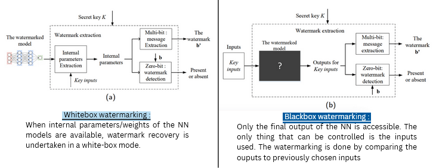

### Attacks on the watermark

### The watermark triangle
We carrying out a watermarking, one has always to keep in mind those 3 principle to keep as high as possible 

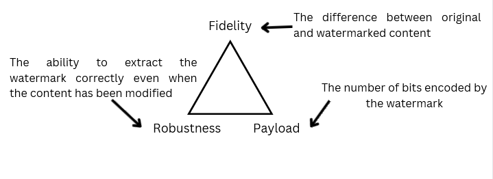

### Our pratical application

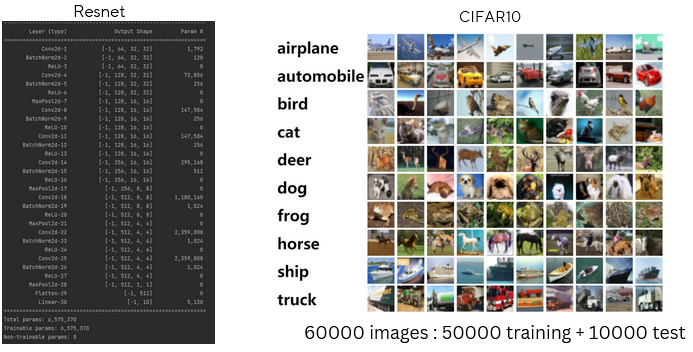

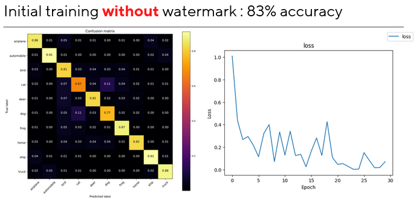

## Blackbox watermarking

### The theory

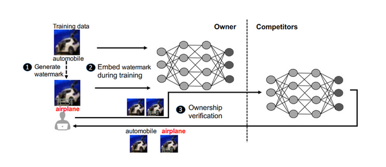

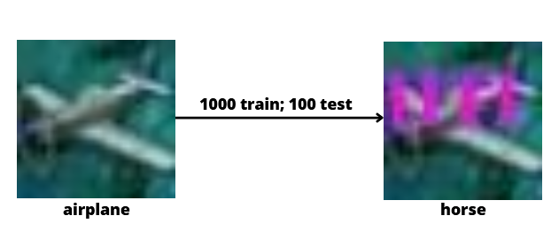

### Our hyperparameters

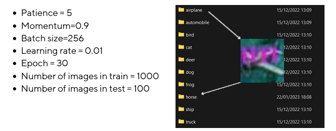

### Our results

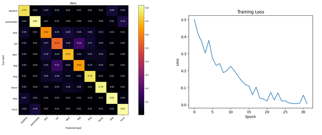

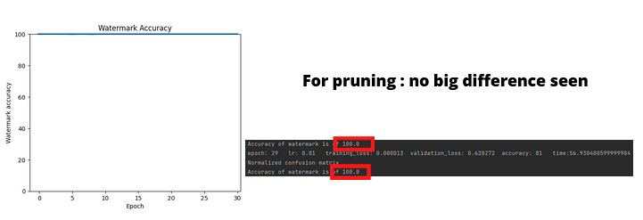

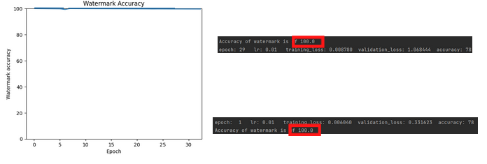

## Whitebox watermarking

### The theory

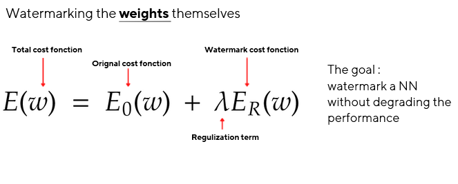

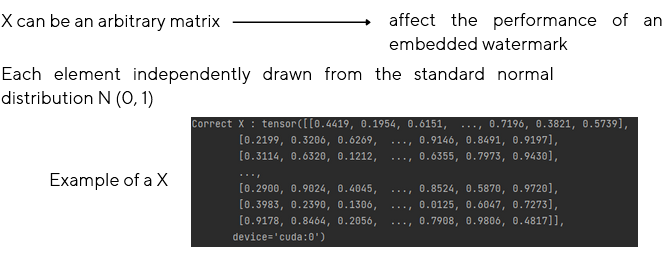

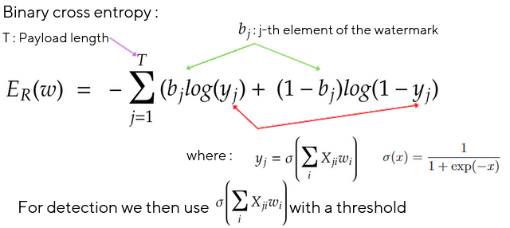

### Our hyperparameters

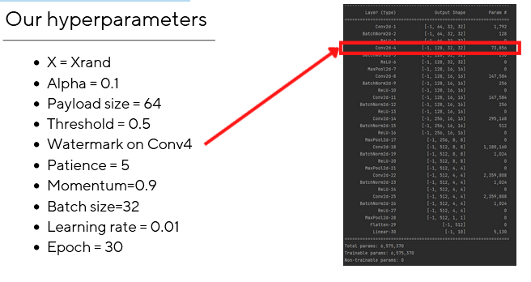

### Our results

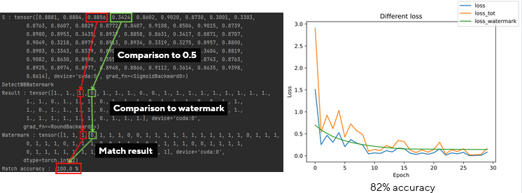

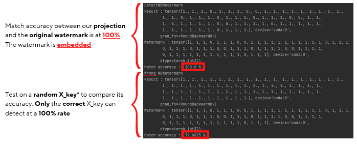

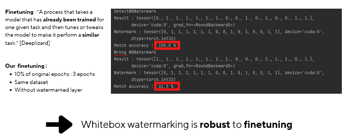

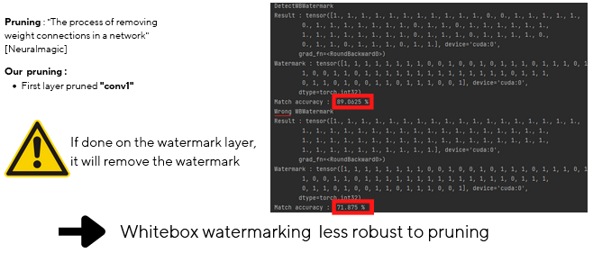

## Conclusion

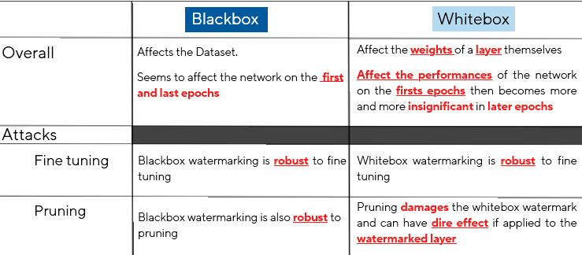

## Sources & thanks
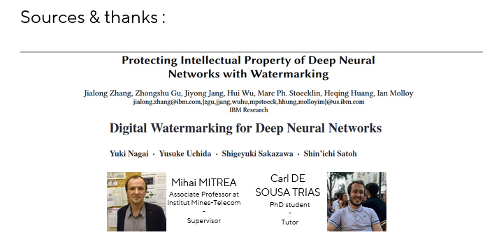
