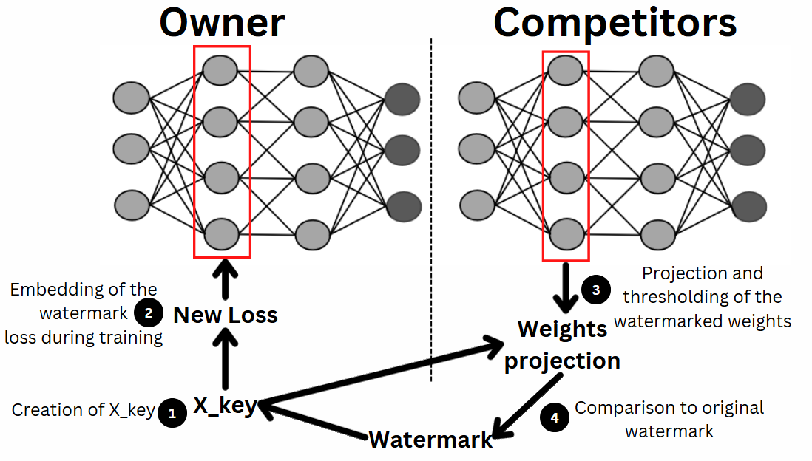

# Neural Network Watermarking

## A bit of context 
In early 2023, the norm of developping a CNN is to copy and paste the weights of already trained CNN. There is, at this date, no way to recognize the training owner yet the dataset and the resources invested in its training represent its value.  
Like visual watermarking, neural network watermarking aims to embed the mark of ownership of the resources of a network in the network itself.  

This work was carried out by STARK Thibaut & BRUN Loïs for an end of engineering school project (PFE) in Telecom SudParis in the major High Tech Imaging under the supervision of [Carl DE SOUSA TRIAS](https://github.com/Carldst) and Mihai MITREA and based on those two papers :  
[Protecting Intellectual Property of Deep Neural Networks with Watermarking](https://dl.acm.org/doi/10.1145/3196494.3196550)  
[Digital Watermarking for Deep Neural Networks](https://arxiv.org/abs/1802.02601)  

## Black and whitebox watermarking

For now, only the two following methods exist for neural network watermarking.  

  

## Attacks on the watermark
They are two main attacks on our watermark that we are trying to resist from. Both are commonly use after copy and pasting the weights of an already trained neural network. It is then important to study their effects on our watermark.  

Thoses two attacks are the following :  
   
For more information on finetuning please see :  
[What is Fine-tuning in Neural Networks?](https://www.baeldung.com/cs/fine-tuning-nn)  
For more information on pruning please see :  
[Pruning Neural Networks](https://towardsdatascience.com/pruning-neural-networks-1bb3ab5791f9)   

## The watermark triangle
We carrying out a watermarking, one has always to keep in mind those 3 principle to keep as high as possible  

## Our pratical application

For our study, we chose to use a simple form of resnet on the cifar10 dataset. We made this choice for its simplicity in usage and how much this dataset and this network architecture are widespread in the deeplearning community.   
   

With those choices and commun hyperparameters, we obtain after a simple training without watermarking thoses results, which will serve as our control trial  

# Blackbox watermarking

## The theory

The main idea behind blackbox watermarking is to embed an unatural error inside the neural network training so that, we the error is detected we can say for sure that this is our watermark  

In order to do that, we transform part of a class of our dataset in a unatural way, for instance by writing "TEST" on it, then we put it in the most visually opposed class. After that data manipulation, we can simply test if a similarly modified image put into the network is returned to as the predicted error  

For our application, we chose to put "HTI" onto images of planes and to move then to the horses label. Planes have a different form and background texture and color than horses.  

## Our hyperparameters

For our experiments, we chose theses hyperparameters since they are communly used for this kind of training  

## Our results

# Whitebox watermarking

## The theory

The idea behind whitebox watermarking is to embed the watermark into the weights themselves. In order to carry out such a task, we need to have access to the weights of a chosen layer.  

In order to change the weights to embed our watermark, we are changing the loss itself. In order to do that we add to the original loss our watermark loss with a regularization term.  
  

This watermark loss is created by using a X_key. This X_key is created with the size of our original watermark (which is a (Tx1) tensor made out of 1 and 0)) and has to be secret. Only with this key you can detect the watermark. X_key is created with randomly generated numbers between 0 and 1.    
 

With that X_key, we can project the layer's weigths onto it then do a binary cross entropy in order to get our previously mentionned watermark loss  
  

So if we recap, the idea behind whitebox watermarking is the following :  

  

## Our hyperparameters

For our experiments, we chose theses hyperparameters since they are communly used for this kind of training. Also we randomly chose to watermark the 4th convolution layer but the watermark can be applied anywhere else.  

  

## Our results

After embedding our watermarks onto the weights of the 4th conv layer during the training. We then reproject thoses weigths onto our initial X_key, when then compare the results of this projection to our threshold which is here 0.5. Then compare this tensor of size of (Tx1) made out of 1 and 0 to our original watermark.  

We can see here that there is a 100% retriaval accuracy of our watermark tensor from thoses watermarked weights.  

Also, we notice that even the watermarking of the loss heavily affect the performance of the model in the first epochs, after several epochs the difference between the original loss and the watermarked loss is insignificant  

The demonstrate the importance of the X_key, we try to deciefer our watermarked weights with a X_key that is different from our own. Here, we take another randomized X_key (which was not used for watermarking the weights).  
The difference between 100% and 80% tells us that only the original X_key can achieve optimal retrivial performances. As such, the secrecy and ownership of the original X_key is paramount to claim ownership of the network.  
  

We finetune with 10% of the training epochs to simulate a real attack of the watermark.  
We notice that there is still a 100% retrieval accuracy and as such, whitebox being robust to finetuning  

We chose to prune the first layer of the network but could have chosen any other. We notice that the retrieval accuracy is affected by this attacks and as such we can say that whitebox watermarking is not robust to pruning  
More importantly, if by a stroke of unluck, the attacker attack the watermarked layer, the watermark completely disappear.  

# Conclusion

We can then, after some experimentation draw this chart for the watermarking of neural network.  

Also, an important point to note is that the watermark naturally decays of the increase of epochs of the attacks. As such, even though one originaly put a certain quantity for the training of a network and watermark it, someone else can put the same amount of effort to retrain this network without the first one being able to claim ownership.
As such, legal and moral implicatoin of the ownership of network training is not resolved by this study.  
## Sources & thanks
This project was carried out on the basis of those two articles. 
We would like to profoundly thank our supervisor and tutor for the precious help they offered in all the aspects of this project  

